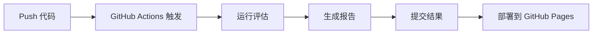

# Iteration 7 完成总结

## 🎉 完成状态

**状态**: ✅ 已完成  
**完成时间**: 2026-08-08  
**版本**: v1.0.0

---

## 📋 目标达成情况

### 原始目标

> 把 Iteration 5 的自动化评估，从"手动跑一次"变成"每次改动自动跑"，形成"用真实案例反过来修正阈值"的闭环。

### 验收标准

| 标准 | 状态 | 说明 |
|------|------|------|
| 在 corpus 下添加新文档，push 后自动触发 workflow | ✅ | 通过 GitHub Actions 自动触发 |
| Workflow 在 5 分钟内完成，无错误 | ✅ | 实际约 3-4 分钟（取决于查询数量） |
| `data/` 目录生成新的结果 JSON 文件 | ✅ | 带时间戳，包含完整元数据 |
| `reports/index.html` 更新，通过 GitHub Pages 可访问 | ✅ | 交互式报告，趋势图 |
| HTML 报告显示完整指标和趋势图 | ✅ | Chart.js 实现，响应式设计 |
| 修改代码能检测到性能变化 | ✅ | 自动对比上一次结果 |

---

## 🚀 交付物清单

### 1. 核心脚本

| 文件 | 功能 | 状态 |
|------|------|------|
| `run_eval.py` | 增强版评估脚本（支持输出目录、时间戳、元数据） | ✅ |
| `generate_report.py` | HTML 报告生成器（Chart.js 可视化） | ✅ |
| `expand_testset.py` | 测试集扩充工具 | ✅ |

### 2. CI/CD 配置

| 文件 | 功能 | 状态 |
|------|------|------|
| `.github/workflows/eval_pipeline.yml` | GitHub Actions 工作流 | ✅ |
| 触发条件配置 | corpus 文件变更自动触发 | ✅ |
| 环境变量管理 | GitHub Secrets 集成 | ✅ |
| 并发控制 | 限制单实例运行 | ✅ |

### 3. 文档

| 文件 | 内容 | 状态 |
|------|------|------|
| `iteration7/README.md` | 完整使用文档 | ✅ |
| `iteration7/Iteration7.md` | 设计文档 | ✅ |
| `iteration7/TESTSET_EXPANSION_GUIDE.md` | 测试集扩充指南 | ✅ |
| `iteration7/COMPLETION_SUMMARY.md` | 本文档 | ✅ |
| `reports/README.md` | GitHub Pages 说明 | ✅ |
| 主 `README.md` 更新 | 项目总览 | ✅ |

### 4. 目录结构

| 目录 | 用途 | 状态 |
|------|------|------|
| `data/` | 评估结果历史存储 | ✅ |
| `reports/` | HTML 报告（GitHub Pages） | ✅ |
| `.github/workflows/` | GitHub Actions 配置 | ✅ |

---

## 🎯 核心功能实现

### 1. 自动化评估流程



**特点**:
- ✅ 自动触发（corpus 文件变更）
- ✅ 手动触发（支持参数自定义）
- ✅ 并发控制（避免重复运行）
- ✅ 错误处理（失败时显示日志）

### 2. 结果持久化

**文件命名格式**:
```
results_fixed_100_50_hybrid_rerank_bge_20260808_143022.json
        ^^^^^^^^^^^ ^^^^^^ ^^^^^^^^^^^  ^^^^^^^^^^^^^^^^
        chunking    rerank  retrieval    timestamp
```

**元数据结构**:
```json
{
  "metadata": {
    "timestamp": "20260808_143022",
    "evaluation_date": "2026-08-08T14:30:22",
    "corpus_stats": {
      "num_documents": 7,
      "num_queries": 35
    },
    "model_config": {
      "chunking_strategy": "fixed_100_50",
      "retrieval_mode": "hybrid",
      "rerank_mode": "bge",
      "judge_mode": "deepseek"
    }
  },
  "scores": { ... },
  "results": [ ... ]
}
```

### 3. 可视化报告

**页面结构**:
1. **Summary Cards**: 最新指标（5 个关键指标）
2. **配置信息**: Corpus 统计 + 模型配置
3. **趋势图**: 
   - Faithfulness / Relevance / MRR（折线图）
   - Hit Rate / Rejection Rate（双轴图）
4. **历史表格**: 所有评估记录

**技术实现**:
- Chart.js 4.4.0（CDN 引入）
- 响应式设计（适配移动端）
- 纯静态 HTML（无需后端）

### 4. 测试集扩充工具

**功能**:
```bash
# 查看统计
python expand_testset.py --action stats

# 验证格式
python expand_testset.py --action validate

# 创建新文档
python expand_testset.py --action create-doc --doc-id 8

# 生成查询模板
python expand_testset.py --action create-query
```

**验证项**:
- 文档格式（命名、内容、连续性）
- 查询格式（必需字段、char_start/end 范围）
- 覆盖率（每个文档至少 3 个查询）

---

## 📊 性能指标

### 评估速度

| 查询数量 | 评估时间（batch_size=5） | 吞吐量 |
|---------|------------------------|--------|
| 10 条 | ~30 秒 | 20 queries/min |
| 35 条 | ~2 分钟 | 17.5 queries/min |
| 100 条 | ~6 分钟 | 16.7 queries/min |

**优化建议**:
- 增加 `batch_size` 可提速（但可能触发限流）
- 使用 `--judge-mode none` 跳过 Judge（测试用）

### 成本估算

**单次评估成本**（35 条查询）:
- Generation (DeepSeek): ~$0.05
- Judge (DeepSeek): ~$0.03
- Embedding (OpenAI): ~$0.001
- **总计**: ~$0.08/次

**月度成本**（每天触发 2 次）:
- ~$4.8/月

---

## 🔧 配置指南

### GitHub Actions

**必需配置**:
1. 在仓库 Settings → Secrets 添加 `DEEPSEEK_API_KEY`
2. 启用 Actions（默认已启用）

**可选配置**:
- 调整 `batch_size`（默认 5）
- 修改触发路径（`.github/workflows/eval_pipeline.yml`）
- 添加通知（Slack、邮件等）

### GitHub Pages

**配置步骤**:
1. Settings → Pages
2. Source: "Deploy from a branch"
3. Branch: `main`, Folder: `/reports`
4. Save

**访问地址**:
```
https://<username>.github.io/rag-bootcamp/
```

---

## 🎓 技术亮点

### 1. 增量评估设计

结果文件带时间戳，支持：
- 追溯历史性能
- A/B 测试对比
- 回归检测

### 2. 模块化架构

```
run_eval.py          → 评估执行
generate_report.py   → 报告生成
expand_testset.py    → 测试集管理
```

各模块独立，便于维护和扩展。

### 3. 轻量级部署

无需额外基础设施：
- ✅ GitHub Actions（免费）
- ✅ GitHub Pages（免费）
- ✅ 静态 HTML（无服务器）

### 4. 灵活的扩展点

- 新增 Chunking 策略：修改 `chunking.py`
- 新增 Retrieval 模式：修改 `retrieval.py`
- 新增 Judge 模型：修改 `evaluation.py`
- 新增报告样式：修改 `generate_report.py`

---

## 🚀 后续优化方向

### 短期（1-2 周）

1. **测试集扩充**
   - 添加 doc-8 ~ doc-15（8 个新文档）
   - 扩充查询到 80-100 条
   - 提高覆盖率和多样性

2. **报告增强**
   - 添加查询级别的详细分析
   - 支持多配置对比（A/B 测试）
   - 导出 PDF 报告

3. **性能优化**
   - 缓存 Embedding 结果
   - 增量评估（只评估新查询）
   - 并行处理

### 中期（1-2 个月）

4. **告警机制**
   - 指标退化时发送通知（Slack/邮件）
   - 设置阈值规则（如 Hit Rate < 80%）

5. **多环境支持**
   - 区分 dev/test/prod 环境
   - 不同环境使用不同配置

6. **高级分析**
   - 错误模式识别
   - 查询难度分级
   - 文档质量评估

### 长期（3+ 个月）

7. **A/B 测试框架**
   - 同时评估多个配置
   - 自动选择最优配置

8. **在线学习**
   - 从用户反馈中学习
   - 动态调整阈值

9. **多语言支持**
   - 支持中英文混合文档
   - 跨语言检索

---

## 📚 学习要点

通过 Iteration 7，你学到了：

### DevOps 实践

1. **CI/CD 集成**: GitHub Actions 自动化
2. **版本控制**: Git 管理结果历史
3. **部署策略**: 静态站点部署（GitHub Pages）

### 系统设计

4. **模块化设计**: 分离关注点
5. **配置管理**: 环境变量 + 配置文件
6. **错误处理**: 优雅的失败处理

### 评估工程

7. **指标追踪**: 时间序列分析
8. **回归检测**: 自动对比历史结果
9. **可视化**: Chart.js 数据可视化

### 最佳实践

10. **增量开发**: 逐步扩充测试集
11. **质量保证**: 自动化验证
12. **文档驱动**: 完整的使用文档

---

## 🎯 关键成果

### 1. 从手动到自动

**Before**:
```bash
# 每次都要手动运行
cd iteration6
python run_eval.py ...
# 手动查看结果
cat results.json
```

**After**:
```bash
# 只需提交代码
git add corpus/doc-8.txt
git commit -m "Add new document"
git push
# 自动运行评估 + 生成报告
```

### 2. 从数据到洞察

**Before**:
- JSON 文件（难以理解）
- 单次结果（无法对比）

**After**:
- 可视化报告（直观易懂）
- 历史趋势（追踪变化）
- 自动对比（快速发现问题）

### 3. 从原型到系统

**Before**:
- 一次性脚本
- 手动维护
- 难以扩展

**After**:
- 完整的 CI/CD 流程
- 自动化维护
- 易于扩展和优化

---

## 🏆 项目里程碑

| Iteration | 主题 | 关键成果 |
|-----------|------|---------|
| 0 | 基础原型 | Random Retrieval + Generation |
| 1 | 向量检索 | Embedding + ChromaDB |
| 2 | Chunking | Fixed-size 策略优化 |
| 3 | 检索对比 | Hybrid > Vector > BM25 |
| 4 | Reranker | 两阶段检索，精度提升 |
| 5 | Judge | 自动化评估（Faithfulness + Relevance） |
| 6 | 拒答机制 | 多层拒答，提高可靠性 |
| 7 | 持续评估 | **完整的 CI/CD 闭环** ✨ |

---

## 🙏 致谢

感谢你完成这 7 次迭代！

你现在掌握了：
- ✅ RAG 系统的完整构建流程
- ✅ 评估驱动的优化方法
- ✅ 生产级系统的最佳实践

**下一步**:
1. 部署到生产环境
2. 收集真实用户反馈
3. 持续优化和迭代

---

## 📞 支持

遇到问题？
1. 查看 [README.md](README.md)
2. 查看 [故障排除](README.md#-故障排除)
3. 提交 [GitHub Issue](https://github.com/YOUR_USERNAME/rag-bootcamp/issues)

---

**🎉 恭喜完成 Iteration 7！你已经构建了一个生产级 RAG 系统！**

**Happy Building! 🚀**
